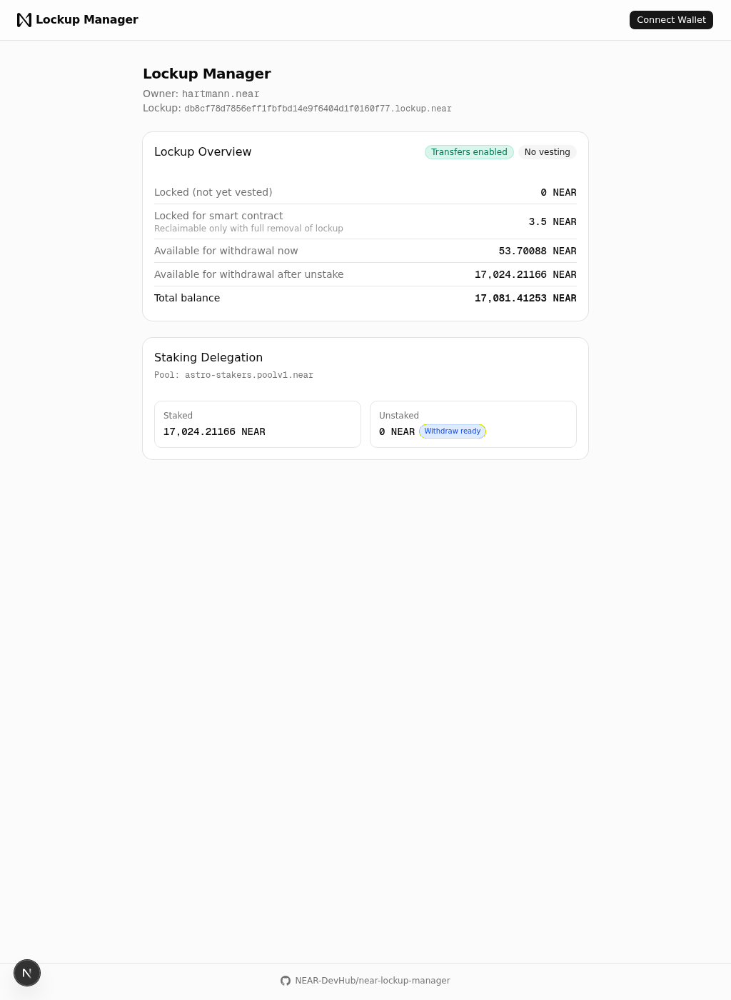

# NEAR Lockup Manager

A web app for managing a NEAR Protocol **lockup contract** as its owner.

- 🌐 **Hosted at:** https://near-lockup.trezu.org
- 📦 **Source:** https://github.com/NEAR-DevHub/near-lockup-manager
- ⛓️ **Contract reference:** https://github.com/near/core-contracts/tree/master/lockup



*Screenshot: the owner dashboard for `hartmann.near` (look-up mode). The lockup
account ID is derived from the owner account via the same rule the
[lockup factory](https://github.com/near/core-contracts/tree/master/lockup-factory)
uses on-chain. When the owner signs in with a NEAR wallet, additional cards
for withdraw/transfer, staking actions (Stake / Unstake / Withdraw), and
lockup removal become available.*

## Features

- **Accurate balance breakdown** split into four categories that always sum to
  the real total: *locked (not yet vested)* · *locked for smart contract
  storage (3.5 NEAR)* · *available for withdrawal now* · *available for
  withdrawal after unstake*. The display is computed from live on-chain state
  and the staking pool's actual position — not from the lockup contract's
  cached `known_deposited_balance`, which understates the real total by any
  accrued staking rewards.
- **Staking delegation** through the lockup: select a whitelisted pool, stake,
  unstake (partial or all), withdraw, refresh pool balance.
- **Withdraw flow** that transfers liquid tokens to any receiver (default: the
  owner account). If the requested amount exceeds the contract's cached
  `get_liquid_owners_balance()`, a `refresh_staking_pool_balance` call is
  batched into the same transaction before the transfer.
- **Safe lockup removal** with a prerequisites checklist enforced up front
  (transfers enabled, no locked amount, no vesting termination, pool staked &
  unstaked both zero). Removal is a 3-step flow: (1) sign a message to derive
  the owner public key, (2) single transaction with two `add_full_access_key`
  calls — one for the owner's key as a backup, one for a temporary browser-
  generated key, (3) the temporary key signs a `DeleteAccount` transaction
  with the owner account as beneficiary.

## Quick start

```bash
pnpm install
pnpm dev     # http://localhost:3000
pnpm build   # production build
```

Mainnet is the only network currently configured (see `src/app/providers.tsx`).
The lockup factory address is hard-coded to `lockup.near`.

## For contributors and AI agents

See [AGENTS.md](./AGENTS.md) for a deep technical reference covering contract
invariants, library gotchas, file layout, and conventions.

## License

MIT — see [LICENSE](./LICENSE).
